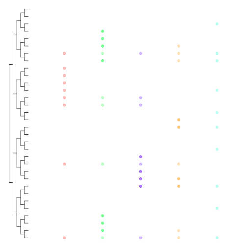
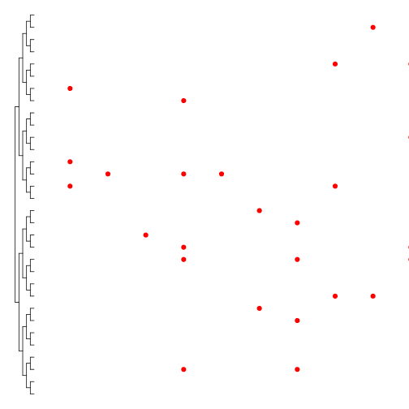
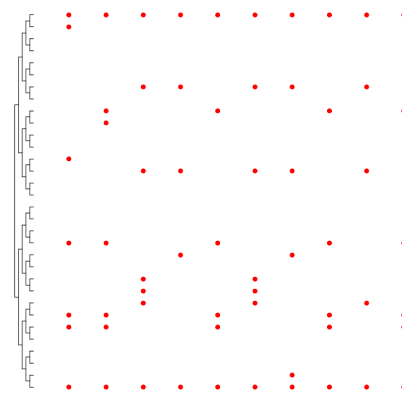
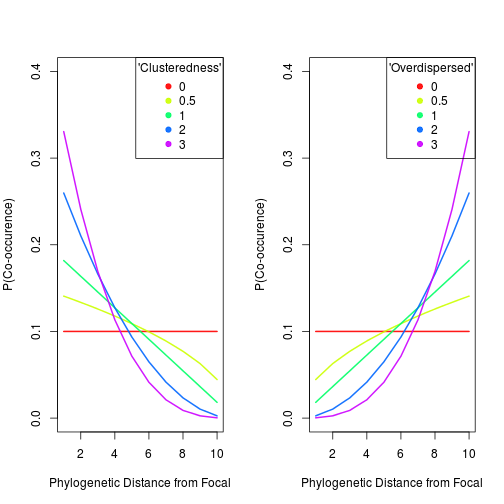
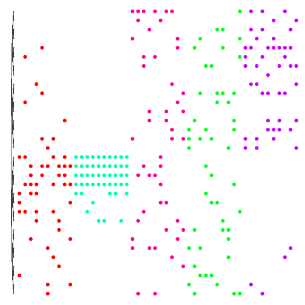

EcoDataTools
============

Collection of tools for manipulating ecological data in R.

Example Use
========================================================

Dependent Libraries
-------------------------
First things first, let's bring in the R pacakges that we'll need and the EcodataTools functions:


```r
library(picante)
library(caper)
library(lme4)
source("EcoDataTools.R")
```


EcoDataTools -- Functions
-------------------------
### Community Phylogeny Functions
#### Test phylogeny
I've saved the Phylocom phylogeny to my working directory. Let's import it and plot it:

```r
phylo <- read.tree("Phylocom_phylo.tre")
plot(phylo)
```

 

Cool beans... now we have a test phylogeny let's see what the functions do.

#### plotComm(comm.data, phylo, groups)
**Description**
Plot the community data alongside the community phylogeny. Every site occupies a column to the left of the phylogeny, for every present species a dot is plotted next to the tip. If the community data represents 2 or more habitat types (e.g. damaged sites and undamaged sites) these can be specified in the *groups* argument. This argument is then used to colour the dots based on habitat type -- each habitat having a disitinctive cut of the colour spectrum (like rainbow()). Abundance data is incorporated into the plot using colour intensity (using the alpha argument in hsv()) -- deepest: highest abundance, lightest: lowest abundance.

**Arguments**
* phylo: the phylogeny to plot alongside
* comm.data: community data to plot
* groups: vector of length nrow(comm.data) specifying the site type

**Code**

```
## function (comm.data, phylo, groups = rep(1, nrow(comm.data))) 
## {
##     variable.max <- (nrow(comm.data) * 10)
##     plot(phylo, no.margin = T, show.tip.label = F, x.lim = c(0, 
##         variable.max))
##     n <- length(unique(groups))
##     hs <- seq.int(0, 1 + max(1, n - 1)/n, length.out = n)%%1
##     alphas <- comm.data/max(comm.data)
##     ntips <- length(phylo$tip.label)
##     spacing <- 10
##     group <- groups[1]
##     j <- 1
##     for (i in 1:nrow(comm.data)) {
##         j <- ifelse(group == groups[i], j, j + 1)
##         pull <- as.logical(comm.data[i, ])
##         taxa <- phylo$tip.label[pull]
##         abunds <- alphas[i, pull]
##         tiplabels(tip = match(taxa, phylo$tip.label), pch = 19, 
##             adj = spacing, col = hsv(rep(hs[j], ntips), 1, 1, 
##                 abunds))
##         spacing <- spacing + 10
##         group <- groups[i]
##     }
## }
```


**Example Plot**

 


### randCommData(phylo, nsites, nspp, pa = TRUE, lam = 0.1)
**Description**
Generate random community data that has no phylogenetic signal. Can either produce presence/absence data or abundace data using Poisson distribution.

**Arguments**
* phylo: the phylogeny on  which the community will be based
* nsites: number of sites
* nspp: number of species for each site
* pa: presence/absence data?
* lam: lambda for poisson distribution if pa is False

**Code**

```
## function (phylo, nsites, nspp, pa = TRUE, lam = 0.1) 
## {
##     ntips <- length(phylo$tip.label)
##     output <- matrix(rep(NA, ntips * nsites), ncol = ntips, nrow = nsites)
##     colnames(output) <- phylo$tip.label
##     if (pa) {
##         for (i in 1:nsites) {
##             output[i, ] <- sample(c(rep(1, nspp), rep(0, ntips - 
##                 nspp)))
##         }
##     }
##     else {
##         for (i in 1:nsites) {
##             output[i, ] <- sample(rpois(ntips, lam))
##         }
##     }
##     return(output)
## }
```


**Example Plot**

 


### evenCommData(phylo, nsites, nspp)
**Description**
Generate evenly distributed community data. Calculates the cummulative phylogenetic distance from a random tip, finds evenly separate tips based on this cummulative phylogenetic distance. (Depends on split0())

**Arguments**
* phylo: the phylogeny on  which the community will be based
* nsites: number of sites
* nspp: number of species for each site

**Code**

```
## function (phylo, nsites, nspp) 
## {
##     ntips <- length(phylo$tip.label)
##     output <- matrix(rep(0, ntips * nsites), ncol = ntips, nrow = nsites)
##     colnames(output) <- phylo$tip.label
##     pd.dists <- cophenetic.phylo(phylo)
##     for (i in 1:nsites) {
##         focal.pd.dists <- pd.dists[, sample(1:ntips, 1)]
##         splits <- split0(1:sum(focal.pd.dists), nspp)
##         cumsum.pd.dists <- cumsum(focal.pd.dists)
##         for (j in 1:nspp) {
##             pull <- which(abs(cumsum.pd.dists - splits[j]) == 
##                 min(abs(cumsum.pd.dists - splits[j])))
##             output[i, pull] <- 1
##         }
##     }
##     return(output)
## }
```


**Example Plot**

 


### genCommData(phylo, focal, nsites, nspp, fact = 1)
**Description**
Generate clustered/overdispersed community data. Take a phylogeny and determine the probability of a species being present from their phylogenetic distance from the focal tip.

**Arguments**
* phylo: the phylogeny on  which the community will be based
* focal: tip from which clustering/overdisperion occurs
* nsites: number of sites
* nspp: number of species for each site
* fact: negative numbers produce overdisperion from focal, positive numbers produce clustering from focal, and 0 generates random data

**Code**

```
## function (phylo, focal, nsites, nspp, fact = 1) 
## {
##     invertVector <- function(dists) {
##         u <- sort(unique(dists), TRUE)
##         s <- sort(u)
##         probs <- rep(NA, length(dists))
##         for (i in 1:length(u)) {
##             probs[u[i] == dists] <- s[i]
##         }
##         return(probs)
##     }
##     ntips <- length(phylo$tip.label)
##     output <- matrix(rep(NA, ntips * nsites), ncol = ntips, nrow = nsites)
##     colnames(output) <- phylo$tip.label
##     pd.dists <- cophenetic.phylo(phylo)
##     focal.dists <- pd.dists[, focal] + 1
##     if (fact > 0) 
##         focal.dists <- invertVector(focal.dists)
##     probs <- focal.dists^abs(fact)
##     probs <- probs/sum(probs)
##     for (i in 1:nsites) {
##         output[i, ] <- ifelse(1:ntips %in% sample(1:ntips, nspp, 
##             prob = probs), 1, 0)
##     }
##     return(output)
## }
```


**How do the probabilities work?**

The co-occurrence of other species in the phylogeny for the idealised phylogenetic distances (1:10) is shown below calcualted with the _genCommData_ function. On the left clustering, on the right overdispersion. 

 


**Example use**
* Create 5 different types of habitat setting tip 16 as focal.
* Types 1 and 2 will produce clustered data with fact 1 and 10
* Type 3 is random
* Type 4 and 5 will produce overdispersed data with fact -1 and -10
* Row bind into a single dataframe called _all_
* Create _types_, a vector to identify the rows in _all_ for plotComm()
* Plot with plotComm()


```r
type1 <- genCommData(phylo, focal = 16, nsites = 10, nspp = 5, fact = 1)
type2 <- genCommData(phylo, focal = 16, nsites = 10, nspp = 5, fact = 10)
type3 <- genCommData(phylo, focal = 16, nsites = 10, nspp = 5, fact = 0)
type4 <- genCommData(phylo, focal = 16, nsites = 10, nspp = 5, fact = -1)
type5 <- genCommData(phylo, focal = 16, nsites = 10, nspp = 5, fact = -10)
all <- rbind(type1, type2, type3, type4, type5)
types <- paste0("t", rep(1:5, each = 10))
plotComm(all, phylo, groups = types)
```

 

